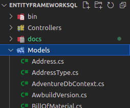

[![Contributors][contributors-shield]][contributors-url]
[![Forks][forks-shield]][forks-url]
[![Stargazers][stars-shield]][stars-url]
[![Issues][issues-shield]][issues-url]
[![MIT License][license-shield]][license-url]
[![LinkedIn][linkedin-shield]][linkedin-url]

<!-- PROJECT LOGO -->
<br />
<p align="center">
  <a href="https://github.com/mortroguez/EntityFrameworkSQL">
    
  </a>
  <a href="https://github.com/mortroguez/EntityFrameworkSQL">
    
  </a>

  <h3 align="center">Entity Framework - SQL Server</h3>

  <p align="center">
    Crear un proyecto siguiento la arquitectura <strong>Database first</strong>
    <br />
    <a href="https://github.com/mortroguez/EntityFrameworkSQL"><strong>Explore the docs »</strong></a>
    <br />
    <br />
    <a href="https://github.com/mortroguez/EntityFrameworkSQL/issues">Reportar Bug</a>
    ·
    <a href="https://github.com/mortroguez/EntityFrameworkSQL/issues">Solicitar ayuda</a>
  </p>
</p>

## Sobre el proyecto

<p>
- El propósito de este proyecto es mostrar como mapear e interactuar con una base de datos en <strong>SQL server</strong> usando el Framework <strong>Entity Framework</strong> y se hará en un proyecto del tipo <strong>Web Api</strong>, en el cual se implementarán los métodos <strong>CRUD</strong> para la tabla de empleados de la base de datos <strong>AdventureWorks2019</strong>  
</p>

### Antes de comenzar 
<p>
- Este proyecto se realizó utilizando <strong>Linux</strong> como sistema operativo base, sin embargo, esto no debería de afectar debido a que la versión de <strong>.Net</strong> que se utilizó corresponde a <strong>.Net Core 5</strong>.
</p>

<p>
- Se utilizó <strong>Visual Studio Code</strong> como editor y la consola de comandos para configurar el proyecto. En caso utilizar <strong>Visual Studio</strong> los métodos no cambian mucho, sin embargo, se especificará que hacer en cada caso.
</p>

<p>
- Si desea replicar este proyecto, por favor descargar la base de datos <a href="https://docs.microsoft.com/en-us/sql/samples/adventureworks-install-configure?view=sql-server-ver15&tabs=ssms">AdevuntureWorks2019</a> y restaurarla, en este proyecto no se enseñará como realizar estos pasos.
</p>

## Entity Framework

<p>Antes de proceder con la creación del proyecto, vamos a verificar que Entity Framework se encuentre instalado de forma local en nuestro equipo, para ello vamos a ejecutar el siguiente comando en la consola de comandos: </p>

``` command promt
$ dotnet ef --version
Entity Framework Core .NET Command-line Tools
5.0.8
```
<p>En caso de que no se muestre en mensaje anterior, se deberá ejecutar el siguiente comando: </p>

``` command promt
$ dotnet tool install --global dotnet-ef
```

<p>Tras ejecutar este comando, se debe proceder a verificar la instalacion ejecutando nuevamente el primer comando, si tras esto continúa mostrándo errores, escribir para solicitar ayuda.</p>

### Creación del proyecto

<p>Para crear el proyecto a través de la consola se deberá hacer usando el siguiente comando: </p>

``` command promt
$ dotnet new webapi -n NombreDelProyecto
```

<p>Una vez creado el proyecto se deberá navegar hacia el directorio creado y abrir el editor con los siguientes comandos</p>

``` command promt
$ cd rutadelproyecto
$ code .
```

<p>En caso de trabajar sobre <strong>Visual Studio</strong> sencillamente deberá crear un nuevo proyecto del tipo <strong>Web Api</strong> y asegurarse de elegir la versión que corresponda a <strong>.NET Core 5</strong></p>

## Librerías

<p>Es necesario descargar las siguientes librerías</p>

* <a href="https://www.nuget.org/packages/Microsoft.EntityFrameworkCore"> Entity Framework Core </a>
* <a href="https://www.nuget.org/packages/Microsoft.EntityFrameworkCore.Tools"> Entity Framework Core Tools </a>
* <a href="https://www.nuget.org/packages/Microsoft.EntityFrameworkCore.SqlServer"> Entity Framework Core SQL Server </a>

<p>Cuando ingrese a cada uno de los link observará distintas opciones para adquirir cada librería, en el caso de usar <strong>Visual Studio Code</strong> deberá copiar el comando de la pestaña <strong>.NET CLI</strong></p>

<p>En el caso de usar <strong>Visual Studio</strong> deberá copiar el comando de la pestaña <strong>Package Manager</strong> y copiará este código en la consola <strong>Package Manager</strong> del editor</p>

## Mapear la base de datos

* Visual Studio Code: 

``` command promt
$ dotnet ef dbcontext scaffold "Data Source=LOCALHOST;Initial Catalog=AdventureWorks2019; User=USUARIO; PWD=PASSWORD" Microsoft.EntityFrameworkCore.SqlServer -o Models -c "AdventureDbContext"
```

* Visual Studio (Package Manager)

``` command promt
$ scaffold-dbcontext "Data Source=LOCALHOST;Initial Catalog=AdventureWorks2019; User=USUARIO; PWD=PASSWORD" Microsoft.EntityFrameworkCore.SqlServer -OutputDir Models -Context "AdventureDbContext"
```

- Data Source: se refiere al nombre de la instancia de SQL Server
- User: usuario con el que inicia sesión en la instancia de SQL Server
- Password: contraseña del usuario para iniciar sesión en la instancia de SQL Server
- o/OutputDir: es el nombre de la carpeta donde se crearán las clases basadas en las tablas. En caso de no ingresar este parámetro, el sistema por defecto creará una carpeta llamada Models.
- c/Context: nombre del objeto que admistrará las conexiones con la base de datos, en caso de no ingresar este parámetro, el sistema le asignará uno por defecto.

<div align="center">
    
</div>

## Connection String

* Paso 1
    - Agregar el "connection string" en el archivo <strong>AppSettings.json</strong>

``` js
"ConnectionStrings": {
"Adventure": "Data Source=LOCALHOST;Initial Catalog=AdventureWorks2019;        User=USER; PWD=PASSWORD"
}
```

* Paso 2
    - Inyectar el "connection string" en la clase <strong>Startup.cs</strong>

``` C#
public void ConfigureServices(IServiceCollection services)
{
        services.AddDbContext<AdventureDbContext>(item => 
            item.UseSqlServer(Configuration.GetConnectionString("Adventure"))
        );
}
```

## Controladores

<p>
- Los controladores son esa parte del sistema con la que podremos interactuar, se trata de clases de C# que heredan de la librería <strong>AspNetCore Mvc</strong>.
</p>

<p>
- Por buenas prácticas, se creará un solo controlador por cada modelo al que se le desee realizar los métodos <strong>CRUD</strong>, este controlador deberá llevar el nombre del modelo y la palabra <strong>Controller</strong>, como sufijo.
</p>

``` C#

using Microsoft.AspNetCore.Mvc; <-- Libreria que permite implementar ControllerBase

------------------------------------

[ApiController]
[Route("api/v1/nombreModelo")] <-- Ruta del controlador
public class NombreModeloController : ControllerBase
{
    // TODO
}
```

<p>
- Para poder acceder al objeto que administra las conexiones, es necesario realizar una inyección de dependencias de la siguiente forma: 
</p>

``` C#

using Microsoft.AspNetCore.Mvc; <-- Libreria que permite implementar ControllerBase

------------------------------------

[ApiController]
[Route("api/v1/nombreModelo")] <-- Ruta del controlador
public class NombreModeloController : ControllerBase
{
    private readonly AdventureDbContext _db; <-- Se instancia el objeto
    public NombreModeloController(AdventureDbContext db)
    {
        _db = db;
    }
}
```

<p>
- El objeto llamado en este caso AdventureDbContext, contiene la definición de todas clases mapeadas en base a las tablas de SQL
</p>

## Verbos HTTP

<p>
- Siguiendo la línea de los métodos <strong>CRUD</strong>, se cuenta con una serie de métodos HTTP que permitirán realizar distintas acciones, los más comunes de ellos son:
</p>

* HTTPGET: para obtener registros
* HTTPOST: para crear registros
* HTTPPATCH: para actualizar registros
* HTTPDELETE: para eliminar registros

## Acciones de Entity Framework

<p>
- La clase  <strong>AdventureDbContext</strong> cuenta con una serie de métodos que ayudan a obtener, agregar, actualizar y eliminar registros y estos son: 
</p>

* _db.Modelo.ToList(); <-- Obtener todos los registros
* _db.Modelo.FirstOrDefault(x => x.Parametro == parametro); <-- Obtener por parametro
* _db.Modelo.Add(modelo); <-- Agregar
* _db.Modelo.Update(modelo); <-- Actualizar
* _db.Modelo.Remove(modelo); <-- Eliminar

<p>
- En el código de este repositorio se encuentra un controlador en el que se implementan estos métodos. En caso de necesitar ayuda puede escribirme al <a href="ehitelrj@gmail.com">correo</a> explicando la situación.
</p>

<!-- Referencias -->
[contributors-shield]: https://img.shields.io/github/contributors/mortroguez/EntityFrameworkSQL.svg?style=for-the-badge
[contributors-url]: https://github.com/mortroguez/EntityFrameworkSQL/graphs/contributors
[forks-shield]: https://img.shields.io/github/forks/mortroguez/EntityFrameworkSQL.svg?style=for-the-badge
[forks-url]: https://github.com/mortroguez/EntityFrameworkSQL/network/members
[stars-shield]: https://img.shields.io/github/stars/mortroguez/EntityFrameworkSQL.svg?style=for-the-badge
[stars-url]: https://github.com/mortroguez/EntityFrameworkSQL/stargazers
[issues-shield]: https://img.shields.io/github/issues/mortroguez/EntityFrameworkSQL.svg?style=for-the-badge
[issues-url]: https://github.com/mortroguez/EntityFrameworkSQL/issues
[license-shield]: https://img.shields.io/github/license/mortroguez/EntityFrameworkSQL.svg?style=for-the-badge
[license-url]: https://github.com/mortroguez/EntityFrameworkSQL/blob/master/LICENSE.txt
[linkedin-shield]: https://img.shields.io/badge/-LinkedIn-black.svg?style=for-the-badge&logo=linkedin&colorB=555
[linkedin-url]: https://www.linkedin.com/in/ehitel-rodriguez-316a9b217/